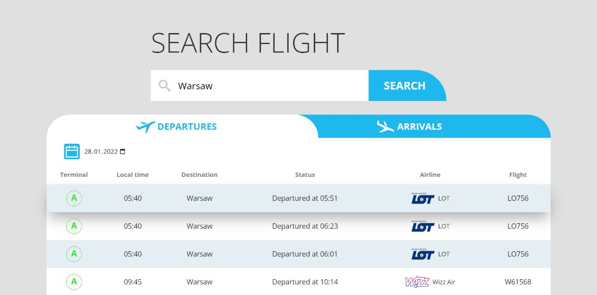

# ✈️Airport board project

  

### _React-powered application for visualisation flights data_

## ✨Features

- Search flight by airline, destionation or flight code
- User-friendly and minimalistic design

## ⚙️Used technologies:

- HTML5
- CSS3
- Flexbox
- SASS preprocessor
- BEM methodology
- JS ES6
- React 
- SPA / React Router
- Redux
- Webpack
- Babel
- ESLint


## Installation

Move to the fold, install all dependencies and run the server:

```sh
cd airport-board
npm i
npm start
```
#### In order to build production version:

```sh
npm run build
```

Airport board requires [NodeJS](https://nodejs.org/) v10+ to build

<hr/>

### Application available via [link](https://master--rococo-smakager-b948fc.netlify.app/) 👈🏻 ###

### Developed by [Andrii Shevchuk](https://github.com/Andrii618/) ###
